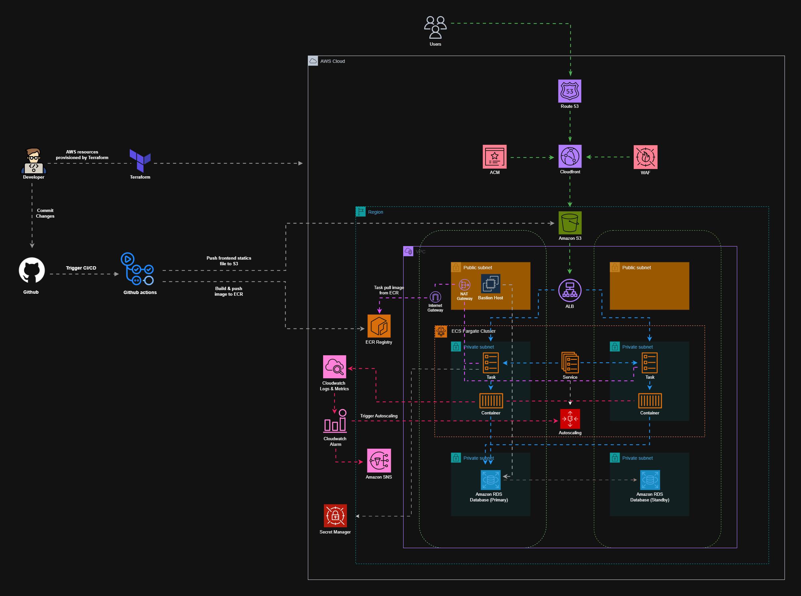

# 🚀 AWS Serverless Infrastructure with ECS Fargate & Terraform

## 📌 Project Overview

This project implements a fully automated, production-grade cloud infrastructure on AWS using **Terraform**. The architecture is designed for highly available, scalable, and secure containerized applications.

**It includes:**

- A secured backend API running on ECS Fargate
- A static frontend hosted on S3 + CloudFront
- RDS MySQL for persistent data
- Full CI/CD automation using GitHub Actions
- No long-lived AWS keys — GitHub OIDC

---

## 🛠️ Tech Stack

- **Cloud Provider:** AWS (Amazon Web Services)
- **Infrastructure as Code:** Terraform
- **Containerization:** Docker & Amazon ECR
- **Orchestration:** Amazon ECS Fargate (Serverless Compute)
- **CI/CD:** GitHub Actions + OIDC
- **Database:** Amazon RDS MySQL (Multi-AZ failover)
- **Security:** AWS WAFv2, AWS Secrets Manager, AWS Certificate Manager (ACM)
- **Networking:** Amazon VPC, Application Load Balancer (ALB), Route53, CloudFront
- **Monitoring:** Amazon CloudWatch Logs, Metrics, Dashboards + SNS Alerts

---

## 📐 Architecture Diagram



---

## 🚀 Infrastructure as Code (IaC) via Terraform

This environment is provisioned entirely using Terraform with the following design principles:

- **Modular Structure:** VPC, ECS, RDS, ALB, WAF, IAM, and more split into reusable modules
- **No Hardcoding:** Values are injected via variables and Terraform outputs
- **Dependency Tracking:** Implicit and explicit dependencies ensure correct deployment flow
- **Reusable Outputs:** ALB DNS, RDS endpoint, ECR repo URLs, and CloudFront IDs exported automatically

---

## 🏗️ High Availability & Reliability

### Multi-AZ Redundancy

- RDS Multi-AZ failover capability
- ECS Tasks spread across availability zones

### Elastic Auto Scaling

- ECS Target Tracking automatically scales containers based on CPU/Memory
- Supports sudden load spikes without downtime

### Rolling Deployments

- New versions replace tasks incrementally
- Application stays available during deployment

---

## ⚖️ Application Load Balancer (ALB)

- Public entry point for backend API traffic
- Health checks ensure only healthy containers receive traffic
- Automated container registration and deregistration

---

## 🛡️ Security & Data Protection

- **AWS WAFv2:** Blocks common exploits + rate limiting
- **AWS Secrets Manager:** Stores database password securely
- **Private Networking:** Backend + DB never exposed publicly
- **HTTPS Enabled:** ACM + Route53 + ALB secure TLS termination
- **Least Privilege IAM:** Access restricted to minimal necessary scope

---

## 💾 Database Performance (RDS)

- Custom Parameter Group with tuned values
- Slow query logging enabled to file
- Database error & slow log shipped to CloudWatch
- Automatic storage expansion to avoid resource exhaustion

---

## 📊 Monitoring, Alerts & Dashboards

CloudWatch Dashboard monitoring:

- ECS CPU/Memory
- RDS metrics
- ALB request/5XX counts
- SNS notifications for alarms
- Multi-layer alerting for fast troubleshooting

---

## 💰 Cost Optimization

- ECS Fargate eliminates idle capacity costs
- CloudFront edge caching minimizes bandwidth
- S3 uses Intelligent-Tiering for static assets

---

## 🔄 CI/CD Pipeline (GitHub Actions)

### 🔹 Frontend (S3 + CloudFront)

- Uploads HTML/CSS/JS to S3
- Removes deleted files
- Invalidates CloudFront cache

### 🔹 Backend (Docker + ECS)

- Builds Docker image
- Tags image with Git commit SHA
- Pushes to ECR
- Renders task definition
- Registers new ECS revision
- Triggers rolling deploy

---

## 🔐 Secure Deployments via OIDC

GitHub Actions assume IAM roles using **OpenID Connect**, eliminating the need to store `AWS_ACCESS_KEY_ID` or `AWS_SECRET_ACCESS_KEY`. Every deployment uses short-lived credentials, improving security and reducing risk.

---

## 📂 Project Structure

```text
├── .github/workflows       # CI/CD Pipeline Definitions
├── infra/                  # Terraform IaC root
│   ├── modules/            # Reusable resource modules
│   ├── main.tf             # Main provisioning file
│   ├── outputs.tf          # Values for pipelines & access
│   └── variables.tf        # Dynamic variable definitions
├── frontend/               # Static UI (HTML)
├── backend/                # Node.js API + Dockerfile
├── image/                  # Architecture diagrams
└── README.md               # Project documentation 
```

---

## 🔧 Getting Started

### Requirements

- AWS Account & IAM admin access
- AWS CLI installed and configured
- Terraform v1.0+
- Docker installed for testing
- Route53 registered domain (optional)

### Deploy Environment Using Terraform

```bash
cd infra
terraform init
terraform plan
terraform apply
```

**Save outputs such as:**

- ECR repo URL
- ECS cluster name
- S3 bucket name
- OIDC IAM Role arn
- CloudFront distribution ID

### Configure GitHub Actions Secrets

Go to: **Repo → Settings → Secrets and variables → Actions**

Add:

| Key | Value |
|-----|-------|
| `AWS_REGION` | e.g. ap-southeast-1 |
| `AWS_ROLE_ARN` | IAM role for OIDC |
| `AWS_ACCOUNT_ID` | Your AWS account |
| `ECR_REPOSITORY` | Backend repo name |
| `ECS_CLUSTER` | ECS cluster |
| `ECS_SERVICE` | Backend service |
| `S3_BUCKET` | S3 bucket |
| `CLOUDFRONT_DIST_ID` | CF distro |

> **No access keys required** — OIDC handles auth.

### Deployment Flow

- Push to `main/backend/` → Backend redeploys to ECS
- Push to `main/frontend/` → Static site sync & cache refresh

---

## 🗑️ Tear Down

```bash
cd infra
terraform destroy
```

---

## 🔁 Rollback (ECS Task Definition)

Deployments generate new ECS task definition revisions and immutable ECR images. If a deployment introduces errors, rollback is fast:

### Console Rollback

1. AWS Console → ECS
2. Choose cluster → service
3. Click **Update**
4. Select previous task definition revision
5. Confirm update

### CLI Rollback

```bash
aws ecs update-service \
  --cluster <cluster-name> \
  --service <service-name> \
  --task-definition <family>:<old-revision>
```

> **Rollback takes ~30 seconds and requires no code changes.**

---
#### This project reflects my current understanding of cloud engineering and DevOps practices. I am continuously learning and improving, and I welcome feedback or suggestions from the community.
---
<div align="center">

⭐ **If you found this project helpful, please consider giving it a star!** ⭐

</div>